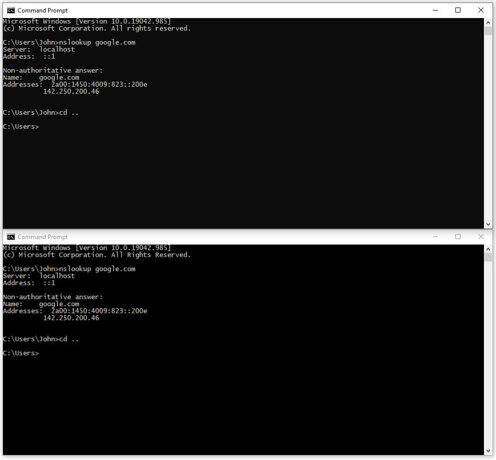
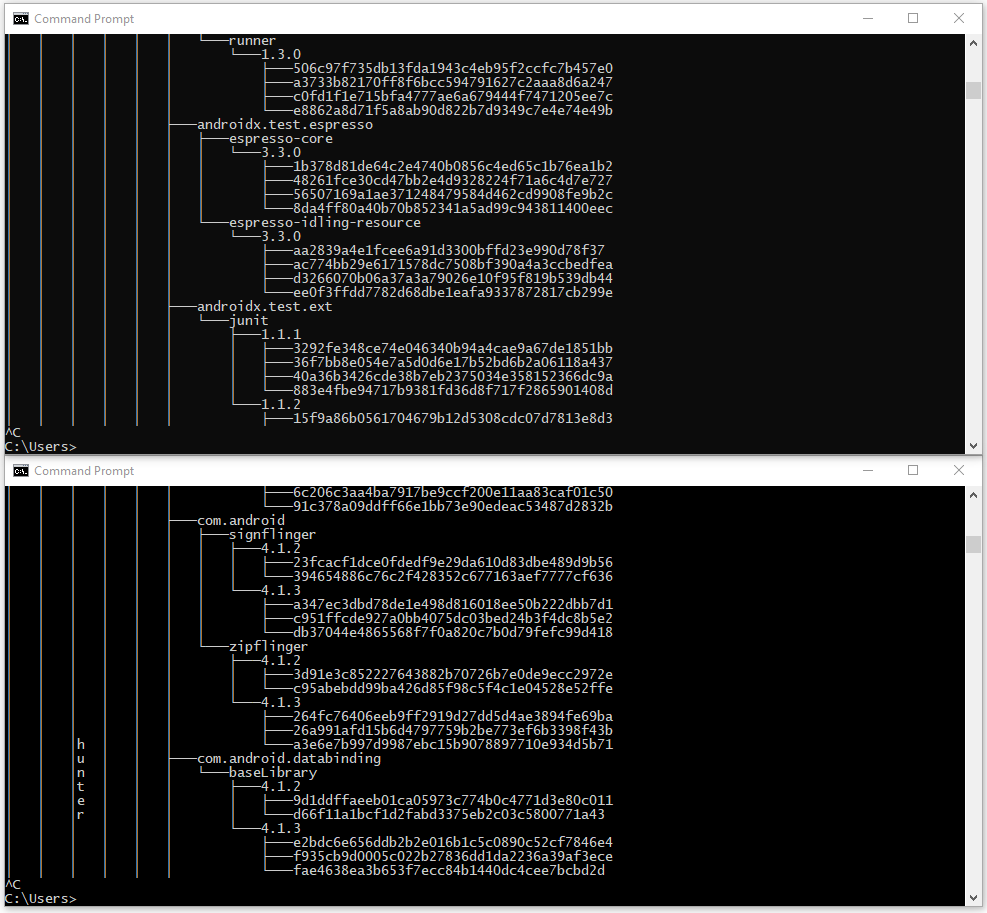

# EditableCMDSanitised

**EditableCMDSanitised** (**ECMDS**) is a wrapper program for ```cmd.exe``` that has an edit mode and plugin support. It is a *sanitised* fork of **EditableCMD**.

There is an **About** section in this README, but it has been moved near the bottom due to its length.

## Unimplemented, Untested, and Broken Features

Although this program is not complete, the features it is currently missing to be a true wrapper are unlikely to be missed for the use case:

* Command line parameter switches ```/f:on``` and ```/f:off```: tab characters are currently disabled.
* Command line parameter switch ```/e:off```: not fully tested.
* Command line parameter switches ```/c```, ```/k```, and ```/s```: not fully tested.
* The ```^``` line-continuation character.
* The ```|``` (pipe), ```>``` (greater than), and ```<``` (less than) characters: for commands offloaded to Command Prompt, Command Prompt handles piping of output.
* Built-in command prompt commands that are window-/session-based.
  * The ```SET``` command: implemented, but not fully tested.
  * Commands like ```SETLOCAL``` are passed to a ```cmd.exe``` sub-process, and when the sub-process exits its environment is lost.
  * Such commands are only usable as part of one-liners.
  * There is currently no plan to support such commands.
* Command Prompt keyboard shortcuts such as F1-F9 are not currently implemented.

[](https://www.youtube.com/watch?v=YhTxH_RVtbU "Video on YouTube: EditableCMD")

Demo video of EditableCMD edit-mode on YouTube.

## Normal Mode

In **normal mode** the console's standard input uses the default console modes.

This allows some normal behaviour such as selecting text with the left mouse button and copying it with the right button.

<figure>
<a href="images/editable-cmd-1.PNG">
</a>
<figcaption>A cmd.exe window and an EditableCMD window. Which is which?</figcaption>
</figure>

## Edit Mode

In **edit mode** text selection is disabled and mouse input is enabled.

Clicking anywhere above the current input line will set the cursor position to where the mouse is clicked, allowing the text to be changed.

If the current prompt and input is ```C:\Windows\System32>tree```, that entire line (up to the window's vertical scroll bar) will be outside the editable area in edit mode. Everything above it (up to the window's title bar) will be inside the editable area.

Edit mode can be entered in 4 ways:
* Typing the command ```edit```.
* Typing the command ```undo```.
* Pressing Ctrl+F1.
* Pressing Ctrl+F12.

> Enabling edit mode only changes the mouse input modes. You have to click inside the editable area before you can edit anything.

Edit mode supports the following:
* Printable characters, such as ```abc```. Typing a character will shift the rest of the line to the right - there is no line-wrap support.
* Arrow keys - move around the editable area.
* Home - move the cursor to the start of the line.
* Backspace - deletes the character to the left of the cursor.
* Delete - deletes the character to the right of the cursor.

Edit mode can be exited in 4 ways:
* Pressing Enter/Return.
* Pressing Escape.
* Clicking the left mouse button below the editable area.
* Using the down arrow key and leaving the editable area.

<figure>
<a href="images/editable-cmd-2.PNG">
</a>
<figcaption>A cmd.exe window and an EditableCMD window.</figcaption>
</figure>

---

## Building

I have used Visual Studio Community 2019.

All solutions and projects currently target .NET 5.0, and some C# 9.0 features are used (the [default C# version](https://docs.microsoft.com/en-us/dotnet/csharp/language-reference/configure-language-version) for .NET 5.0).

**EditableCMD** relies on [watfordjc/**EditableCMDLibrary**](https://github.com/watfordjc/EditableCMDLibrary), which has been added to the Visual Studio solution as a project dependency and added as a git submodule.

In order to initialise and populate (or update) the **EditableCMDLibrary** git submodule, run the following command from the ```EditableCMD``` solution or project directory:

```git submodule update --init --recursive```

A Publish profile for creating a self-contained win-x64 Release build should be included which will create a single file (```cmd.exe```) in the publish directory ```bin\Release\net5.0\publish\```, along with debug symbols and documentation XML for EditableCMDLibrary.

Rename ```EditableCMDSanitised\EditableCMD\Properties\PublishProfiles\FolderProfile.pubxml.user.sample``` to ```FolderProfile.pubxml.user``` - the ```.pubxml.user``` file is not version-controlled as publish history is written to it, but Publish may not work if the file doesn't exist.

Assuming all the dependencies are satisfied, it should just be a case of clicking the **Build** menu in Visual Studio, clicking **Publish EditableCMD**, and then clicking the Publish button next to ```FolderProfile.pubxml```.

---

## Plugins

EditableCMD supports plugins, although the plugin system and EditableCMDLibrary APIs are still a work in progress.

At the moment only keyboard input plugins are supported, and only command plugins have been tested.

Some sample plugins are available in the [watfordjc/**EditableCMDPlugins**](https://github.com/watfordjc/EditableCMDPlugins) repository.

[](https://www.youtube.com/watch?v=6DDKEIobs5g "Video on YouTube: EditableCMD - Plugins and Edit-Mode")

Demo video of the RainbowTree plugin and edit-mode on YouTube.

### Plugin Creation

To create a plugin, you can add the [watfordjc/**EditableCMD_Plugin_Template**](https://github.com/watfordjc/EditableCMD_Plugin_Template) ```.zip``` file to your Visual Studio project templates and then create a new solution/project using it.

You will also need a copy of the [watfordjc/**EditableCMDLibrary**](https://github.com/watfordjc/EditableCMDLibrary) ```.dll``` or project. The template assumes that (in priority order) the EditableCMDLibrary project is in the current solution (with solutions stored in the directory ```..\..\``` relative to the template project), or in a solution called EditableCMDLibrary, EditableCMDSanitised, or EditableCMD.

It expects to find ```EditableCMDLibrary.dll``` for the current build configuration. For example, if the EditableCMDSanitised solution exists, and you're building a ```Debug``` build of a plugin, it will try using ```..\..\EditableCMDSanitised\EditableCMDLibrary\EditableCMDLibrary\bin\Debug\net5.0\EditableCMDLibrary.dll```.

If you change the settings/location of the EditableCMDLibrary dependency, note the settings in the template's original ```.csproj``` file. ```Private=false``` and ```ExcludeAssets=runtime``` are needed otherwise EditableCMD may not be able to find the plugin's dependencies.

To test a plugin, you'll need a copy of **EditableCMD** or **EditableCMDSanitised**.

### Plugin Folders

EditableCMDSanitised will search for the path ```Plugins\Commands``` in the following locations:

* The directory the running ```.exe``` is located - e.g. ```[...]\bin\Release\net5.0\publish\```
* ```%LocalAppData%\EditableCMDSanitised``` - e.g. ```C:\Users\John\AppData\Local\EditableCMDSanitised\```
* ```%AppData%\EditableCMDSanitised``` - e.g. ```C:\Users\John\AppData\Roaming\EditableCMDSanitised\```
* ```%ProgramData%\EditableCMDSanitised``` - e.g. ```C:\ProgramData\EditableCMDSanitised\```
* ```%ProgramFiles%\EditableCMDSanitised``` - e.g. ```C:\Program Files\EditableCMDSanitised\```
* ```%LocalAppData%\EditableCMD``` - e.g. ```C:\Users\John\AppData\Local\EditableCMD\```
* ```%AppData%\EditableCMD``` - e.g. ```C:\Users\John\AppData\Roaming\EditableCMD\```
* ```%ProgramData%\EditableCMD``` - e.g. ```C:\ProgramData\EditableCMD\```
* ```%ProgramFiles%\EditableCMD``` - e.g. ```C:\Program Files\EditableCMD\```

> EditableCMD will not search the four EditableCMDSanitised locations.

### Plugin Loading Process

1. Determine which **Plugin Folders** exist.
2. For each Plugin Folder, do a recursive file search for ```.dll``` files (returned in ```Directory.GetFiles()``` order).
3. Remove any duplicate absolute paths.
4. Load the DLLs.
    1. Load any implementations of the ```ICommandInput``` interface contained in the assembly.
    2. If an assembly doesn't contain any ```ICommandInput``` implementations, the assembly gets unloaded.

As with all of the builtin implementations of ```ICommandInput```, they are added as event listener delegates to the events in the order they are loaded.

### Keyboard Input Events

An event is sent to the delegates in the order they were added, and the first event handler to set ```Handled=true``` on an event should be the only one that does anything with it.

The plugins should be loaded and called based on their properties, so the delegates are called in the following order:

* Plugin event handlers that support edit mode.
* Builtin handlers that support edit-mode.
* Plugin event handlers that support key presses (but not commands).
* Builtin handlers that support key presses (but not commands).

Delegates that support commands now use a different event, so are called in the following order:

* Plugin event handlers that support commands.
* Builtin handlers that support commands.

The move to ```interface``` implementations for both builtin handlers and plugins, and the load order prioritising plugins, means that most keyboard I/O handling should be customisable.

---

## About

The difference between **EditableCMD** and **EditableCMDSanitised** is that EditableCMDSanitised has been *sanitised*.

This is a branch of EditableCMD that has had all **grey** features and information removed, and then all commits squashed into the initial commit. As a result, it has a completely separate git history to EditableCMD.

> **Grey** features and information are code, comments, and README text that could class EditableCMD as a potentially unwanted program (a PUP, AKA riskware), or could be built upon to create malicious software (malware).
>
> My use of **grey** can be taken to be the "grey"/"gray" aspect of **greyware**/**grayware**.

EditableCMDSanitised should function mostly the same as EditableCMD, because most of the **grey** content does not affect its overall functionality.

> **So, what is grayware and what’s the big deal?**
>
>As its name might suggest, grayware is a category of software that sits in that ‘gray area’ – a sort of no-man’s land – between outright malware and legitimate conventional software.
>
>Grayware – which is sometimes referred to as potentially unwanted programs (PUPs) – is not obviously malicious and is not classified as a virus, but it can still be irritating and even harmful. It includes files or applications that can carry out unwanted actions, such as tracking your behaviour online or sending you a barrage of pop-up windows. Grayware can be annoying, but – more importantly – it can affect your computer or mobile device’s performance and expose it to security risks.
>
> &mdash;[What is Grayware?](https://uk.norton.com/norton-blog/2015/08/what_is_grayware.html), Norton UK Blog


Such things removed/replaced include the icons, the application's properties, command logging, and information on how to have EditableCMD supersede Windows command prompt.

Basically, EditableCMDSanitised has had all of the things that make EditableCMD *look* like the real Command Prompt removed, as well as some information on how to make EditableCMD "replace" ```cmd.exe``` (air quotes because the ```System32``` folder and its contents, including ```cmd.exe```, aren't touched in the instructions/guides).

The version/copyright header has been retained (with a little modification) because it is still a wrapper around Command Prompt. By default, with the exception of some builtin command handling, commands (including Command Prompt internal ones) are handled by Command Prompt.

EditableCMDSanitised has been created because the **grey** features in EditableCMD early on made me decide the repository should be **Private** and restricted to very few people (such as certain scam baiters).

The plugin system, however, might be used by a wider community of developers including the followers/subscribers of scam baiters that want to add functionality to EditableCMD. Someone might just want a Command Prompt replacement that uses ```bash```'s autocompletion algorithm.

One of the grey features of EditableCMD isn't even in the EditableCMD repository because malware (including some crypto hijackers) have attempted and failed to implement that feature. Their implementations tend to break things in Windows, and in doing so give away their presence. My implementation works, so has a very restrictive licence (and availability) to try to limit misuse.

### Inspiration and History

The idea of EditableCMD's purpose is not new. You can search YouTube for various videos of people using a fake "```cmd.exe```" to try and fool scammers.

There are Google results of malware being detected because Command Prompt is either opening when it shouldn't or because it is broken.

I caught the tail end of one of Kitboga's Twitch streams where he was attempting to create a console application that resembled Command Prompt but had the additional feature of being able to edit the output buffer.

Twitch Chat is not a place to type pseudocode, let alone blocks of code.

I watched back the VOD whilst dabbling with some ideas, found the source Kit was deriving from near the end (when he searched for converting mouse position into a cursor position), and slowly started implementing Command Prompt's basic functionality into a console application.

The edit feature was one of the first. The goal of "look the same as Command Prompt", however, has meant implementing more and more of ```cmd```'s functionality in C#.

### Greyware Functionality

The **grey** features in EditableCMD are somewhat inspired by malware, scam baiters, scammers, corporate network "security policies", and hackers (BlackHat, DEFCON, ethical hacking, InfoSec Twitter/YouTube, etc.).

"How do I&hellip;?" questions have drawn on the time I spent as a channel operator in #Windows95 on DALnet dealing with tech support issues (quite often malware related in the early 2000s), time spent as a WikiProject Malware member, and "defensive" (sometimes anti-privacy) copyright protection practices (Sony CDs, SecuROM, SafeDisc, CSS, AACS, BD+, HDCP, Denuvo, etc.)

Without experience of malware and PUPs, I might not have asked some of those questions, they might have been "Can I&hellip;?" questions instead, or (if I had the assumption deceptive software would be blocked) would've assumed "That's impossible."

Such malware/PUPs I have some knowledge of include ILOVEYOU, Sub7, Beast (not the SSL/TLS vulnerability), MSBlast and Welchia, Sasser, SmitFraud and Vundo (I still have a copy of SmitFraudFix and VundoFix somewhere, previously burned to CD and a custom WinPE disc), the Sony rootkit, Zlob, Psybot, Alureon, Stuxnet, Zeus and SpyEye, Shamoon, CryptoLocker, MEMZ, Mirai, WannaCry, Petya, and NotPetya.

It isn't so much the malicious functionality of the PUPs/malware, but the deceptive functionality/design and "why is it still there?" persistence. A wrapper around Command Prompt that looks, acts, and feels like Command Prompt involves some deceptive design. Something that runs instead of (or automatically inside) Command Prompt whenever/however ```cmd.exe``` is launched involves some deceptive functionality.

---

## Licence and Copyright

For now this isn't in LICENSE and COPYRIGHT files as it is bit complicated with a dash of uncertainty.

Most of the code in NativeMethods is from Microsoft Win32 documentation and P/INVOKE wiki sites.
* Microsoft's GitHub mirror of their Win32 documentation states the code is licensed MIT and the documentation is licensed CC BY 4.0.
  * XMLDOC including a ```<seealso href="https://docs.microsoft.com/...">``` in NativeMethods is licensed CC BY 4.0.
  * DllImports, constants and enums in NativeMethods that are linked to Microsoft documentation are licensed MIT.
* In the case of pinvoke.net, I "automatically grant a non-exclusive, perpetual, worldwide and irrevocable licence, with a right to sub-license, to any other person who wants such a licence to copy, use, adapt, modify or distribute that source code as they see fit, provided that the source code may not be used in any unlawful, defamatory, obscene, offensive or discriminatory way."
  * structs and methods in NativeMethods that are not generated from Microsoft documentation and/or code are licensed per the above license.

All original code by WatfordJC (John Cook) in this C# project is &copy; John Cook and licensed MIT.
